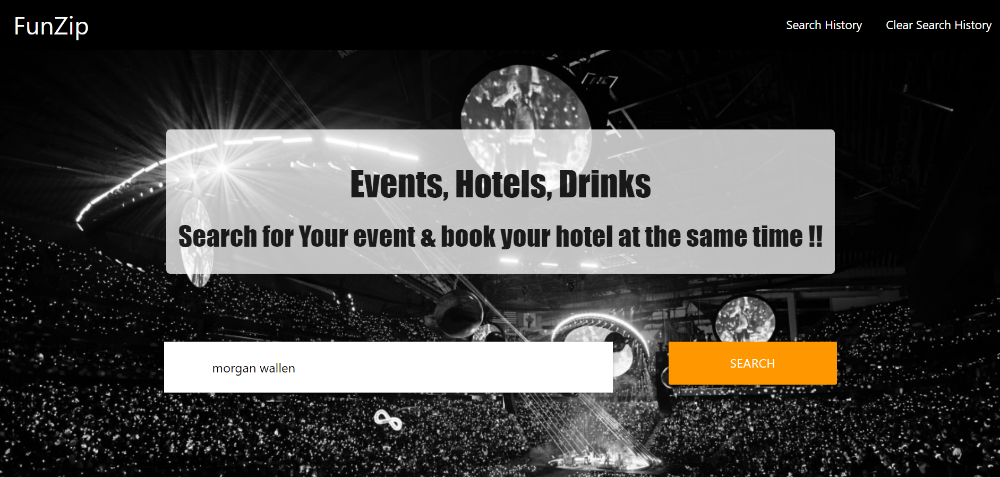
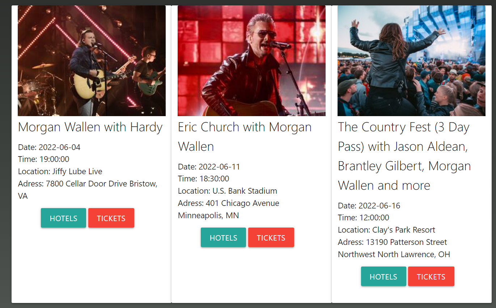
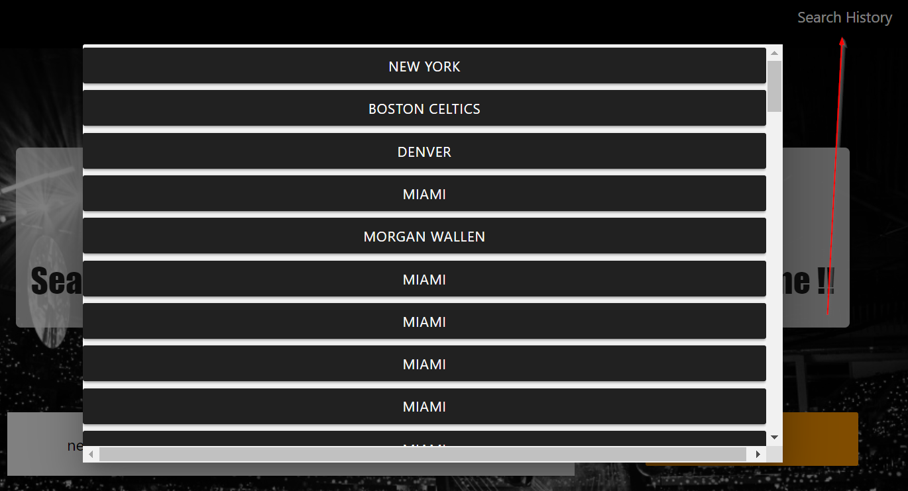
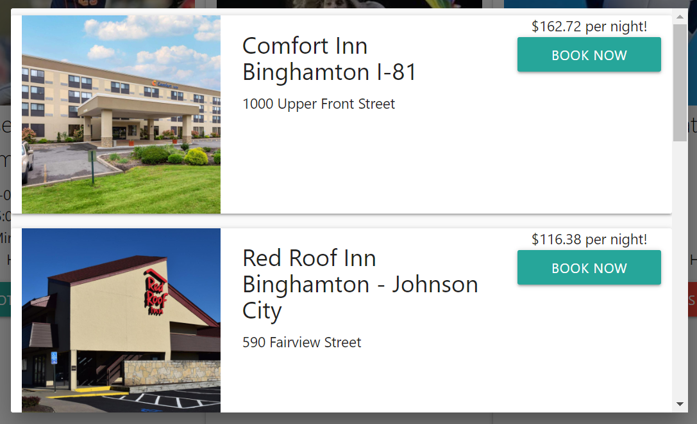

# FunZip

# User Story

AS A tourist, I WANT to see the events happening in a particular place and find nearby hotels on the same website SO THAT I can plan all the aspects of my trip in one place.

# Description

This application is designed for users to be able to search for events and hotels near those events in the same location.

When the user opens the page, they are greeted with a navigation bar and a search field. The user will enter a city or a performer that they are looking for events for. Events for that city or performer will show below in the form of cards.

On larger screens the events will show three wide and on cell phones the events will show as individual cards stacked on top of each other.

The user then has two options with each card. The first button, which says HOTELS, pulls up a modal with all of the nearby hotels to that event. When the user is in that modal they will see information on the hotel such as the name, address, price, and an image. Then, on the right hand side, is a button that the user can click to book their hotel at Booking.com.

The other option that the user has on the event screen is that they can click the TICKETS button to go to the Seat Geek website where they can immediately purchase tickets for that event.

Additionally, all of their searches are saved on localStorage. Therefore, users can click the Search History button in the upper right hand corner of the page to pull up a list of the places they have searched. This allows the user to go back to those searches if they wish.

The goal of our design was to make it convienent for users to plan multiple parts of their vacation in one place.

# Future Enhancements

We believe that there are several enhancements that we could make to our application. First, our hotels are currently limited to the city of the event. We could query our hotels against the address of the venue to get a more precise list of what hotels are nearby.

Addtionally, the hotels are sorted by popularity. We could give the user the option to sort by a wide variety of criteria such as price, popularity, distance to the venue, and etc.

We believe that the website could be more responsive as well. Currently, on large screens the card height is at a set hard-coded height because the cards become mis-aligned if we give the cards a more responsive size. We would want to make all of the cards the same size as the card with the most content. That being said we have it hard-coded to a height that not many users will see the details of the event extend beyond the card.

# Link

https://robsquaadd.github.io/home-zip
